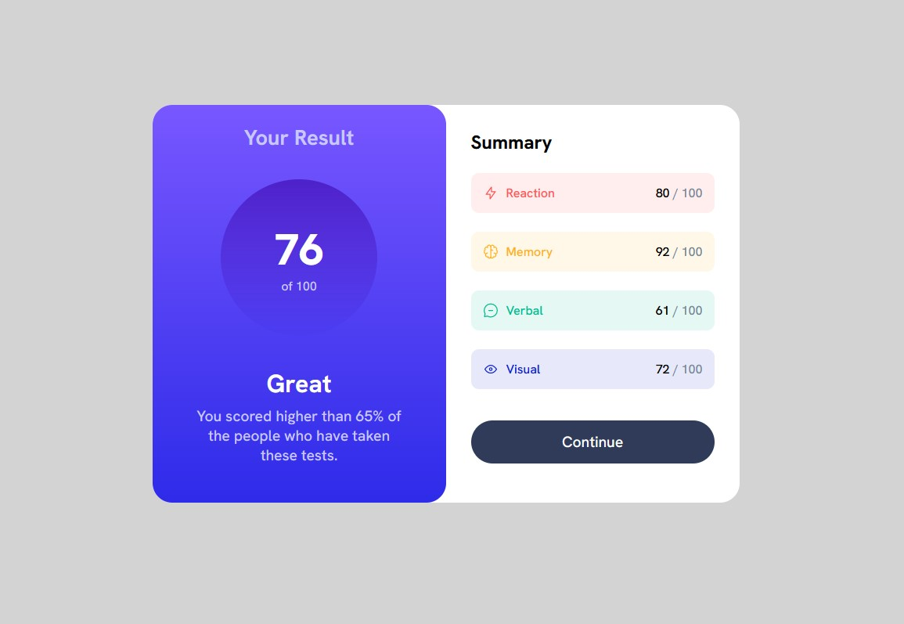

# Frontend Mentor - Results summary component solution

This is a solution to the [Results summary component challenge on Frontend Mentor](https://www.frontendmentor.io/challenges/results-summary-component-CE_K6s0maV). Frontend Mentor challenges help you improve your coding skills by building realistic projects. 

### Screenshot

### Links

- Solution URL: [Solution](https://github.com/palmettophoto/results-summary-component.git)
- Live Site URL: [Add live site URL here](https://palmettophoto.github.io/results-summary-component/)

## My process

### Built with

- Semantic HTML5 markup
- CSS custom properties
- Flexbox

## Author

- Website - [Add your name here](https://rockhillvideomarketing.com)
- Frontend Mentor - [@Taddo](https://www.frontendmentor.io/profile/taddo)

